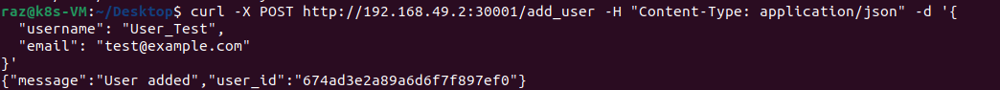

# Microservices Project - Docker & Kubernetes

## Project Overview

This project involves creating and deploying a set of microservices in two stages:

### 1. Dockerized Microservices

Each service (User, Product, Order) was created in separate folders, containerized with Docker, and tested using Docker Compose.

### 2. Kubernetes Deployment

The services were then re-deployed using Kubernetes with **NodePort** services for external access, replacing the initial Docker Compose setup.

### 3. Cleanup

After testing everything, a cleanup script was created to remove all Kubernetes resources (Deployments, Services, PVC).

---

### Screenshots From The VM

